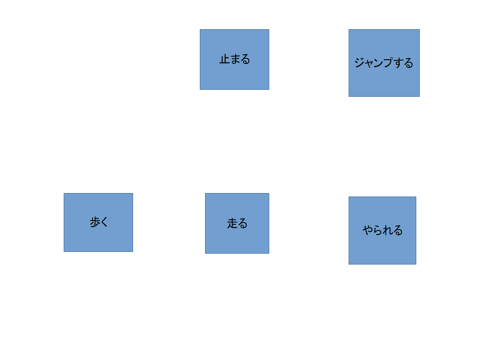
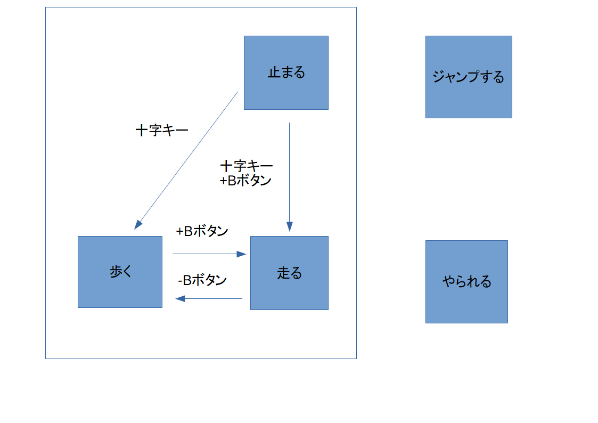
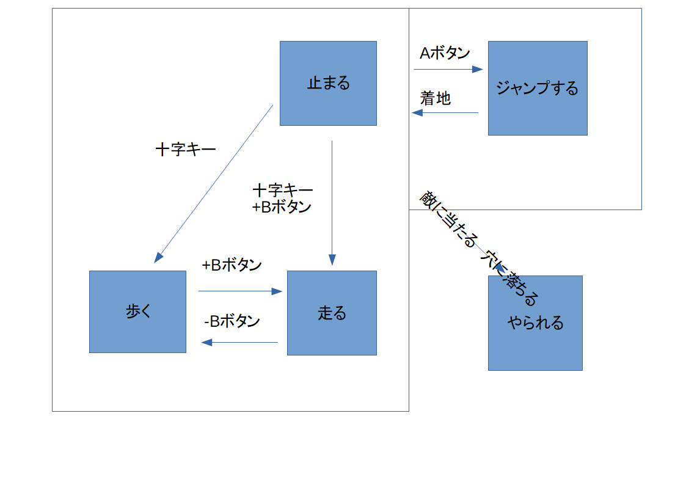

# プログラムの設計図を書く

プログラミングで複雑なものを作る為には、プログラムの設計図を書く事で綺麗に作る事が出来ます。
設計図は様々な手法がありますが、今回はステート図という、ハードウェアと最も相性が良い手法を紹介します。


## ステート図

プログラムが持つ状態及び、状態ごとに移り変わる条件をまとめた図です。
プログラムの全機能まとめ図とも考えられます。

この図を作る事により、プログラムの方向性がはっきりします。


## ハードウェアとの関連性

ハードウェアが持つ状態（例えば、時計なら時間を表示する・時間を調整するなど）をステート図ではっきり書き示す事により、プログラミングがやりやすくなります。


## ステート図一例

マリオを例にします。

マリオは、「止まる」「歩く」「走る」「ジャンプする」「やられる」等の5つの状態を持ちます。



マリオは十字キーを押すと動かす事が出来、Bボタンを一緒に押すと走ります。



ジャンプは、歩行状態（止まる・歩く・走るなど）に関わらず行う事が出来ます。


どのような状態でも、敵に触れたり、穴に落ちたりするとやられます。




## ステート図をプログラムに変換する

マリオの場合、歩きながら走ったり、止まりながら歩いたりといった、歩行状態の共存は出来ません。
逆に、ジャンプとの共存（止まりながらジャンプ）は可能ですし、どの状態でも敵に衝突するとやられます。

今回の例では、敵への衝突を重要視し最初の方に置いています。

```
if 敵に衝突 and 穴に落ちる:
  やられる

if 十字キー == 押されている:
  if Bボタン == 押されている
    走る
  else:
    歩く
else:
  止まる

if Aボタン == 押されている:
  ジャンプする
```

## 途中