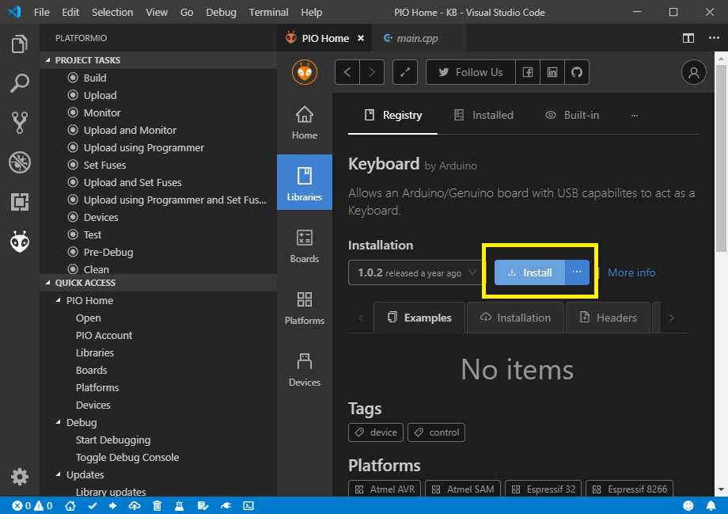
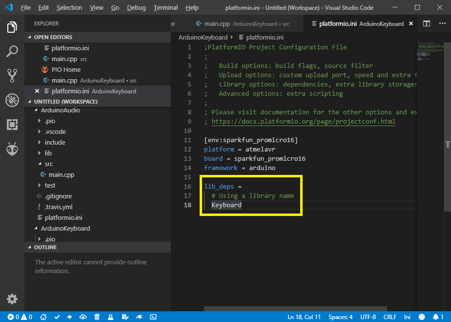

# これからやること

プログラミングの部分はコピーでいいや。

このプログラムの動作を理解しようと思うと、余裕で時間が足りないから、概要だけ下の方に書くから残りは自分で頑張って調べて🌟


# ゲームパッドを作ろう

動かすゲームは決めてないから、とりあえず文字が表示される仕組みにした。

出てくる文字を「W, A, S, D」になればゲームパッドになるよ

後はコントローラー用の部品を購入すれば完璧（実は手元にある）


## はじめに

  * プログラムは用意する。途中までの導入、及び配線をする事により機能する。


## 必要なもの

  * Visual Studio CodeがインストールされたPC
  * Pro Micro


## PlatformIOを使用し、プログラミングをする準備をする

PlatformIOは、Visual Studio Codeなどで組み込み系（基板を使うもの）プログラミングをする時に必要なソフトウェアです。


### プロジェクトを作成する

PlatformIOでは、プログラミングを始める時に、プロジェクト作成が必要になります。

1. PlatformIOのメニュー画面を表示させ、黄枠の「New Project」を押す


2. 黄枠には適当な英数字、橙枠はSparkfun Pro Micro 5Vを選択し、赤枠内のボタンを押す


3. プロジェクトが作成される

編集するファイルは、黄枠（main.cpp）及び橙枠（platformio.ini）だけです。


### プログラミングをする為の準備をする

ライブラリを用いますと、プログラミングの手間を大幅に減らす事が出来ます。

文字が出るプログラムを作る為には、文字入力用のライブラリが必要になります。


1. 黄枠の「PIO Home」をクリックした後、Librariesをクリック、赤枠の入力画面が出てくるので、「Keyboard」と入力、濃赤色枠内のKeyboardと書かれている箇所をクリックする


2. Installをクリックする


3. 「platformio.ini」を開き、黄枠内を追加する



## プログラミングをする

1. 黄枠内に下記の文章を写した後（画像内の文章は書き写さない）、橙枠、赤枠の順番で押す


```
#include <Arduino.h>
#include <Keyboard.h>
#define sw1 4
void setup() {
  pinMode(sw1, INPUT);  
  Keyboard.begin();
}

void loop() {
  if (digitalRead(sw1) == HIGH) {
    tone(9, 4000, 100);
    delay(100);
  }
}

```

## 配線をする

1. ブレッドボード上に以下のように配線する。


※パーツの形が違うけどごめんね🌟


## 動く仕組み

スイッチ、及びプログラムの仕組みを説明します。


### スイッチ

電源をつなげる（VCC, GNDを配線する）と、OUTから、ボタンを押した時だけプラスの電気（専門用語でHIGHと言う。ちなみにマイナスの時はLOW）が流れるようになります。


### プログラムの仕組み

基板の4番ピンに、プラスの電気（HIGH）が流れた時に、9番ピンに接続したブザーを鳴らすプログラムが入っています。

