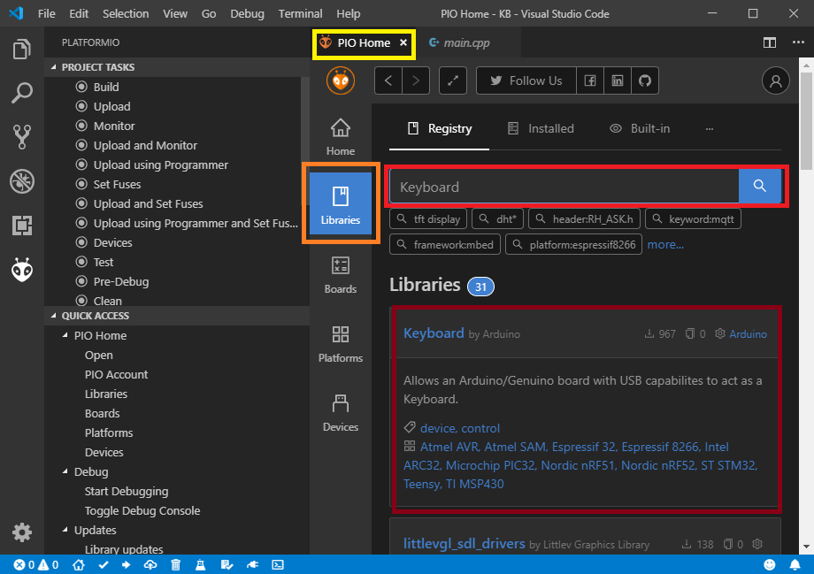

# 繋ぐと文字が出るおもちゃを作ろう

## やれること

  * ケーブルを繋いだ時に、文字を表示させることが出来る基板が作れる。
  * 応用することで、マウスやキーボードなどを作る事が出来る。

## 必要なもの

  * Visual Studio CodeがインストールされたPC
  * Pro Micro

## PlatformIOを使用し、プログラミングをする準備をする

PlatformIOは、Visual Studio Codeなどで組み込み系（基板を使うもの）プログラミングをする時に必要なソフトウェアです。


### プロジェクトを作成する

PlatformIOでは、プログラミングを始める時に、プロジェクト作成が必要になります。

1. PlatformIOのメニュー画面を表示させ、黄枠の「New Project」を押す


2. 黄枠には適当な英数字、橙枠はSparkfun Pro Micro 5Vを選択し、赤枠内のボタンを押す


3. プロジェクトが作成される

編集するファイルは、黄枠（main.cpp）及び橙枠（platformio.ini）だけです。


### プログラミングをする為の準備をする

ライブラリを用いますと、プログラミングの手間を大幅に減らす事が出来ます。

文字が出るプログラムを作る為には、文字入力用のライブラリが必要になります。


1. PlatformIOのメニュー画面を表示させ、黄枠の「New Project」を押す


2. PlatformIOのメニュー画面を表示させ、黄枠の「New Project」を押す


3. PlatformIOのメニュー画面を表示させ、黄枠の「New Project」を押す


## プログラミングをする

1. 黄枠内を全て写した後、橙枠、赤枠の順番で押す


## 動く仕組み

keyboardライブラリを多用しています。

```
Keyboard.press(KEY_LEFT_GUI);
Keyboard.press('r');
Keyboard.releaseAll();
```

最も肝心な点は以上です。

`Keyboard.press(KEY_LEFT_GUI);`はWindowsキー（キーボードの左下にある、Ctrlの隣のアイコンキー）、`Keyboard.press('r');`はrキーを押し続ける命令です。

しかし、押し続けてしまうとPCが動作しなくなってしまう為、`Keyboard.releaseAll();`で中断させています。


## 改造例

### ボタンを押した時に反応するように改造

ボタンが押されるまで、一時的にプログラムの実行を止めるような改造をする。

  1. ボタンを増設する。静電容量式ボタンを使用する場合は、ピン配置（GND、VCC、I/O）の内、GNDをArduinoのGND、VCCを5V、I/Oを任意のピン番号（今回は3とする）に接続する。
  2. 認識するボタンを追加する。例えばピン番号3番目の`void setup() {}`の{}内に、`pinMode(3, INPUT);`を追加
  3. ボタンが押されるまで、プログラムの処理を中断する命令を追加する。`void loop() {}`の{}内の1行目に`while(digitalRead(3) == LOW) {}`を追加


### ボタンを押すとシャットダウンされるように改造

  1. `Keyboard.print("notepad");`を`Keyboard.print("shutdown -s");`に書き換える